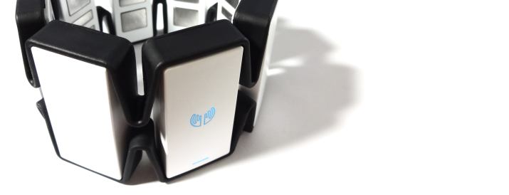

# myo

Nim bindings for the Thalmic Labs Myo gesture control armband SDK.




## About

This package contains bindings to the *Myo SDK* for the
[Nim](http://nim-lang.org) programming language. The Myo is a gesture control
armband that lets users wirelessly control a computer by detecting electrical
activity in arm muscles.

## Supported Platforms

This package was last built and tested with **Myo SDK 0.8.1** and
**MyoConnect 0.9.1**. The bindings currently support the following platforms:

- ~~Android~~
- ~~iOS~~
- MacOS X
- Windows


## Prerequisites

### Android

TODO

### iOS

TODO

### MacOS X

Download and install the latest *MyoConnect* software from the Thalmic Labs
download page, as well as the *Myo SDK for Mac* from the Thalmic Labs developer
portal. This package currently expects the SDK's Xcode framework to be installed
in */Library/Frameworks/myo.framework*. You can simply create a symbolic link to
where you installed the SDK, for example:

```
ln -s /Users/YourName/Sdk/myo_sdk_0.8.1/myo.framework /Library/Frameworks/myo.framework
```

### Windows

Download and install the latest *MyoConnect* software from the Thalmic Labs
download page, as well as the *Myo SDK for Windows* from the Thalmic Labs
developer portal. Copy the `myo32.dll` and/or `myo64.dll` files from the SDK
into your program's directory.


## Dependencies

This package does not have any dependencies to other Nim packages at this time.


## Usage

Import the *libmyo* module from this package to make the bindings available
in your project:

```nimrod
import libmyo
```

This package also contains the types needed for the official Myo Bluetooth API.

```nimrod
import myohw
```

Please note that Bluetooth communication itself is not included - a separate
library for Bluetooth Low Energy is required for the desired target platform.


## Support

Please [file an issue](https://github.com/nimious/myo/issues), submit a
[pull request](https://github.com/nimious/myo/pulls?q=is%3Aopen+is%3Apr)
or email us at info@nimio.us if this package is out of date or contains bugs.
For all other issues related to Myo devices visit the developer portal below.


## References

* [Thalmic Labs Download Page](https://www.thalmic.com/start/)
* [Thalmic Labs Developer Portal](https://developer.thalmic.com/)
* [Myo Bluetooth API Specs](http://developerblog.myo.com/myo-bluetooth-spec-released/)
* [Nim Programming Language](http://nim-lang.org/)
